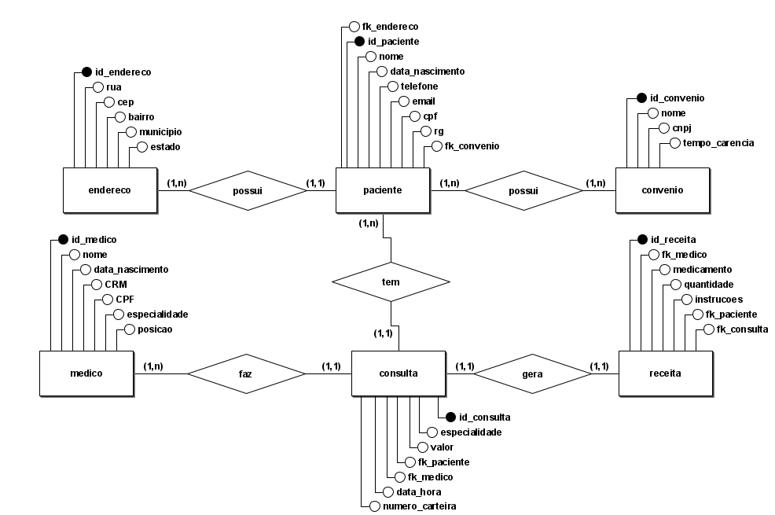
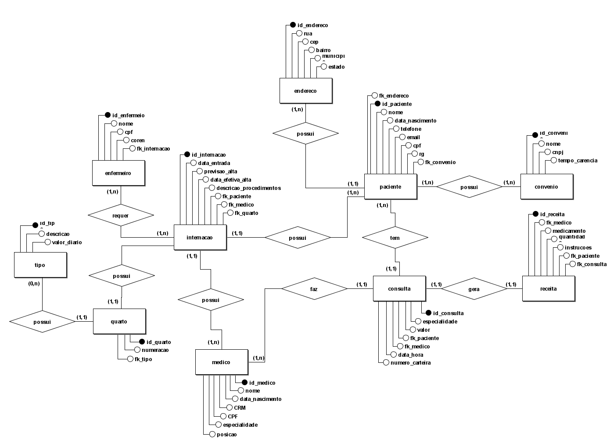

# 🏥 Hospital Fundamental

## Parte 1 – Levantamento Inicial e Proposta de Modelagem

### Uma história para começar

Um pequeno hospital local busca desenvolver um novo sistema que atenda melhor às suas necessidades. Atualmente, parte da operação ainda se apoia em planilhas e arquivos antigos, mas espera-se que esses dados sejam transferidos para o novo sistema assim que ele estiver funcional.

Neste momento, é necessário analisar com cuidado as necessidades desse cliente e propor uma estrutura de banco de dados adequada, por meio de um **Diagrama Entidade-Relacionamento (DER)**.

### Requisitos levantados

A primeira demanda do hospital está focada em **controlar as consultas realizadas na área clínica**. Os seguintes requisitos foram identificados:

- **Médicos** devem ser cadastrados com seus dados pessoais. Eles podem ser:
  - Generalistas;
  - Especialistas;
  - Residentes.

  Cada médico pode possuir uma ou mais especialidades. Entre as especialidades disponíveis estão:
  - Pediatria;
  - Clínica Geral;
  - Gastroenterologia;
  - Dermatologia.

> Observação: alguns registros antigos ainda estão em formulários de papel, mas precisarão ser inseridos no novo sistema.

- **Pacientes** também devem ser cadastrados com os seguintes dados:
  - Nome;
  - Data de nascimento;
  - Endereço completo;
  - Telefone;
  - E-mail;
  - CPF;
  - RG;
  - Convênio médico.

- Para cada **convênio**, devem ser registrados:
  - Nome;
  - CNPJ;
  - Tempo de carência.

- As **consultas**, atualmente registradas em planilhas, devem conter:
  - Data e hora da realização;
  - Médico responsável;
  - Paciente atendido;
  - Valor da consulta ou nome do convênio;
  - Número da carteira do convênio;
  - Especialidade buscada pelo paciente.

- Deseja-se ainda informatizar a emissão de **receitas médicas**, contendo:
  - Medicamentos receitados;
  - Quantidade;
  - Instruções de uso.

Com isso, espera-se que o sistema permita **gerar relatórios de receita** para impressão ou **visualização online** pelo paciente após o encerramento da consulta.

### Diagrama Entidade-Relacionamento (DER) Inicial

A estrutura proposta para atender aos requisitos levantados foi modelada conforme o diagrama abaixo:

---

## Parte 2 – Expansão das Funcionalidades: Controle de Internações

Após a primeira versão do projeto de banco de dados para o sistema hospitalar, notou-se a necessidade de expansão das funcionalidades, incluindo alguns requisitos essenciais a essa versão do software. As funcionalidades em questão são voltadas para o **controle de internações de pacientes**.

Será necessário expandir o Modelo ER desenvolvido e montar o banco de dados, criando as tabelas correspondentes para o início dos testes. No cenário atual do hospital, as internações têm sido registradas por meio de formulários eletrônicos que gravam os dados em arquivos.

Cada **internação** deve conter:
- Data de entrada;
- Data prevista de alta;
- Data efetiva de alta;
- Descrição textual dos procedimentos a serem realizados.

As internações também devem ser vinculadas a **quartos** do hospital, contendo:
- Numeração do quarto;
- Tipo do quarto (apartamento, quarto duplo ou enfermaria), com descrição e valor diário.

Além disso, é necessário controlar os **profissionais de enfermagem** responsáveis pelo acompanhamento dos pacientes durante sua internação, sendo exigidos os seguintes dados:
- Nome;
- CPF;
- Registro no conselho de enfermagem (COREN).

A internação é, obviamente, vinculada a um **paciente**, que pode se internar mais de uma vez, e também a **um único médico responsável**.

### Modelo Entidade-Relacionamento (DER)

O modelo abaixo ilustra visualmente a estrutura lógica proposta para atender aos novos requisitos do sistema:

---

## Estrutura do Banco de Dados

### `tbl_endereco`
Armazena os dados de endereço dos pacientes.

- `rua`, `bairro`, `municipio`, `estado`: Localização detalhada.
- `cep`, `numero`: Complementam o endereço completo.

### `tbl_tipo_quarto`
Define os tipos de quarto disponíveis no hospital.

- `descricao`: Tipo do quarto (ex: apartamento, enfermaria).
- `valor_diario`: Valor cobrado por dia de internação.

### `tbl_quarto`
Representa os quartos físicos do hospital.

- `numeracao`: Número do quarto.
- `fk_tipo`: Chave estrangeira que aponta para o tipo do quarto.

### `tbl_medico`
Contém os dados dos médicos cadastrados.

- `nome`, `data_nascimento`, `cpf`, `crm`: Identificação do profissional.
- `especialidade`: Área médica de atuação.
- `posicao`: Tipo de vínculo (ex: residente, especialista).

### `tbl_convenio`
Armazena os convênios aceitos pelo hospital.

- `nome`, `cnpj`: Identificação do convênio.
- `tempo_carencia`: Tempo de carência contratual.

### `tbl_paciente`
Contém os dados dos pacientes.

- Dados pessoais e documentos (`cpf`, `rg`).
- Relacionamento com `tbl_endereco` e `tbl_convenio`.

### `tbl_internacao`
Registra cada internação realizada no hospital.

- `data_entrada`, `previsao_alta`, `data_efetiva_alta`: Informações sobre o período de internação.
- `descricao_procedimentos`: Texto livre sobre o tratamento.
- Chaves estrangeiras:
  - `fk_paciente`: Relaciona ao paciente internado.
  - `fk_medico`: Médico responsável.
  - `fk_quarto`: Quarto de internação.

### `tbl_enfermeiro`
Lista os enfermeiros envolvidos nas internações.

- `cpf`, `coren`: Identificação e registro profissional.
- `fk_internacao`: Relaciona o enfermeiro à internação.

### `tbl_consulta`
Registra consultas médicas ambulatoriais.

- `especialidade`, `valor`, `data_hora`, `numero_carteira`: Informações da consulta.
- Relacionamentos com `tbl_paciente` e `tbl_medico`.

### `tbl_receita`
Armazena as receitas médicas emitidas ao final de cada consulta.

- `medicamento`, `quantidade`, `instrucoes`: Detalhes da prescrição.
- Relacionamentos com `tbl_consulta`, `tbl_paciente`, e `tbl_medico`.

---

## Script SQL

Para consultar a criação completa das tabelas descritas, acesse o script SQL no arquivo [`script.sql`](sistemaHospitalar.sql) presente neste repositório.
